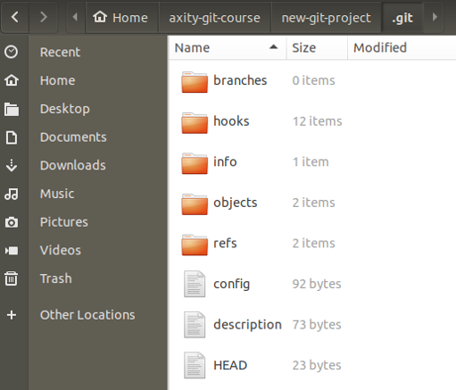

# Creando un Repositorio de Git

Antes de empezar a utilizar Git, es necesario que exista un repositorio.

Si recordamos:

> Un **repositorio** - es un directorio que contiene un proyecto, así como algunos archivos internos para la gestión y administración del propio proyecto de Git.

## Crear directorio

El primer paso es crear un directorio de archivos. Para esto se deben ejecutar los siguientes comandos:

    # cd ~
    # mkdir axity-git-course
    # cd axity-git-course
    # mkdir new-git-project
    # cd new-git-project

Otra forma de hacerlo es ejecutando el siguiente comando:

    # cd ~
    # mkdir -p axity-git-course/new-git-project && cd $_

## Inicializando un Repositorio

Inicializar un proyecto es una de las actividades más simples, basta con ejecutar el siguiente comando:

    # git ini

Al ejecutar el comando git init se generan todos los directorios y archivos necesarios que Git usará para mantener el control de versiones de todo.

Aquí hay una breve sinopsis de cada uno de los archivos/directorios en el directorio **.git**:
  

 - **config**: donde se guardan todos los ajustes de configuración específicos del proyecto, incluida la configuración inicial (nombre, e-mail). Ver la siguiente documentación para mayor detalle: [Git Book](https://git-scm.com/book/en/v2/Customizing-Git-Git-Configuration)
  
 - **description**: este archivo solo lo usa el programa GitWeb, por lo que puede ser ignorado
  
 - **hooks**: aquí es donde se pueden colocar scripts ya sea del lado del cliente o del servidor y que se pueden usar para conectar los diferentes eventos del ciclo de vida de Git
  
 - **info**: contiene el archivo de exclusión global
  
 - **objects**: almacena todos los **commits** realizados
  
 - **refs**: contiene apuntadores a los **commits**, básicamente a los "**branch**" y "**tags**"

## Clonando un Repositorio
<!--stackedit_data:
eyJoaXN0b3J5IjpbNDEyMjYxNTA4LC0xNzUzMDY4MzgwLDE3OD
Y0Njk4MDEsMTY0Njg3MTQzNiw0MTczMTY4MV19
-->