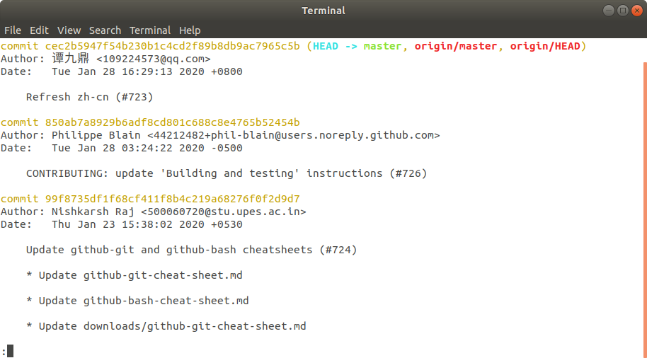

# Lección 05 - Analizando el Historial del Repositorio

En esta lección revisaremos los siguientes temas:

 - Mostrar los commits del repositorio
 - Cambiar la forma en que Git Log muestra la información
 - Revisar los archivos modificados
 - Revisar los cambios en los archivos
 - Revisar un commit específico

## Mostrar los commits del repositorio

> En la lección anterior ejecutamos:

>    ```# cd ~/axity-git-course/training-kit```
>    ```# git status```

> Dónde la salida nos mostró lo siguiente:

>    ```    On branch master```
>    ```    Your branch is up to date with 'origin/master'.```
>    ```nothing to commit, working tree clean```

En este punto no podemos saber que cambios se hicieron sobre los archivo de este repositorio.

Para conocer todos los cambios realizados sobre el repositorio, ejecutar el siguiente comando:

    # cd ~/axity-git-course/training-kit
    # git log

Como resultado podemos ver todo el historial de cambios realizado a los archivos:



Por defecto este comando muestra la siguiente información:

-   SHA
-   El autor
-   Fecha
-   Mensaje

Para navegar a través de log podemos usar las siguiente teclas:

-   scroll **down**
    -   `j` o `↓` para moverse hacia abajo una línea a la vez
    -   `d` para moverse cada mitad de página
    -   `f` para moverse una página entera
-   scroll **up**
    -   `k` o `↑` para moverse hacia arriba una línea a la vez
    -   `u` para moverse cada mitad de página
    -   `b` para moverse una página entera

 - `q` para **salir** del log

## Cambiar la forma en que Git Log muestra la información

El comando `git log` tiene la opción `--oneline` la cual permite modificar la forma en que se muestra la información por defecto.


## Revisar los archivos modificados


## Revisar los cambios en los archivos


## Revisar un commit específico
<!--stackedit_data:
eyJoaXN0b3J5IjpbMTY5Mjg2NjE0MCwtNjQ0MDY3MjM5LDgxMD
g3MTI4OCwxNDMzNzQwOTAzLC00NDgyNDQ1OTVdfQ==
-->