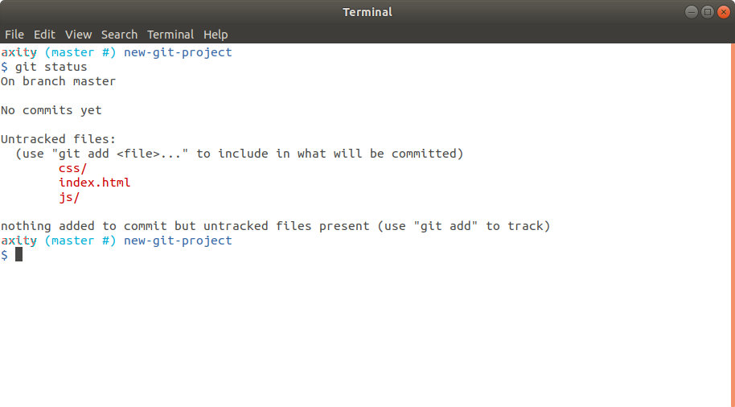
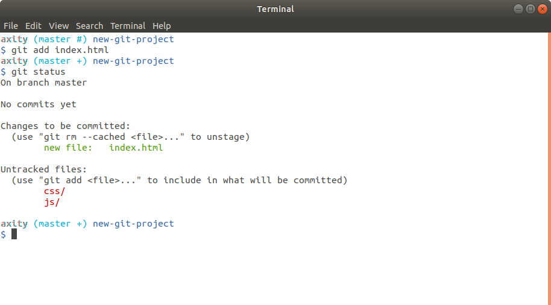
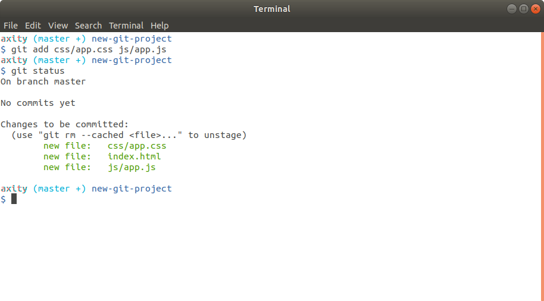

# Agregando commits al repositorio

En esta lección veremos como:

 - Empezar a utilizar nuestro repositorio
 - Agregar commits
 - Mensajes de un commit
 - Revisar lo que ha cambiado
 - Omitir archivos en Git

## Empezar a utilizar nuestro repositorio

Antes de empezar a trabajar en nuestro repositorio debemos movernos al directorio `new-git-project` 

```bash
$ cd ~/axity-git-course/new-git-project/
``` 
Posteriormente ejecutar el comando:

```bash
$ git status
```
```bash
On branch master

Initial commit

nothing to commit (create/copy files and use "git add" to track)
```

### Crear un archivo HTML

Ahora creamos un archivo `index.html` 
```bash
    $ touch index.html
```
Dentro del archivo `index.html` debemos incluir el siguiente código:

```html
<!doctype html>
<html lang="en">
<head>
    <meta charset="utf-8">
    <title>Blog Project</title>
    <meta name="viewport" content="width=device-width, initial-scale=1">
    <meta name="description" content="">
    <link rel="stylesheet" href="css/app.css">
</head>
<body>

    <script src="js/app.js"></script>
</body>
</html>
```

> Podemos ver que en código hace referencia a un archivo CSS  y otro  de JavaScript.

Adicional debemos:
 - crear el directorio `css` y dentro de él crear el archivo `app.css`
 - crear el directorio `js` y dentro de él crear el archivo `app.js`

```bash
$ mkdir css
$ mkdir js
$ touch css/app.css
$ touch js/app.js
```

Revisamos el estatus del repositorio después de crear directorios y archivos:

```bash
$ git status
```


#### ¿Qué significa esto?


Para agregar el archivo `index.html` al Staging Index, debemos ejecutar el comando:
```bash
$ git add index.html
```
Revisamos nuevamente el estatus del repositorio:
```bash
$ git status
```


Para mover el resto de los archivos al Staging Index, ejecutamos el siguiente comando:

```bash
$ git add css/app.css js/app.js

# otra opción sería:
$ git add .
```

Volvemos a revisar el estatus del repositorio:

```bash
$ git status
```



Podemos observar que ahora todos los archivos se encuentran en el Staging Index.

> Si por error agregamos un archivo al Staging Index y queremos devolverlo, podemos usar el comando `git rm --cached <file1> <file2>...`

### Aprovechar el poder del comando `git status`

> En este punto ya podemos identificar que `git status` es un comando bastante útil. Siempre debemos tenerlo en mente antes y después de cualquier otro comando de Git.

## Agregar commits

> Antes de avanzar, debemos estar seguros de haber configurado el editor por defecto de Git, ya que a partir de aquí lo usaremos para editar los mensajes de los commits.

Para hacer nuestro primer commit debemos ejecutar el siguiente comando:
```bash
$ git commit
```
> Observemos el caracter `*` en el prompt `(master *)`. Esto indica que existen cambios que no hay sido enviados a un commit.

El comando `git commit` abrirá `Atom` donde podemos ingresar el mensaje del commit. Este mensaje deberá describir el cambio que se está realizando.


En este casa ingresaremos el mensaje `Initial commit`. Pero tú puedes ingresar el mensaje que desees. 

Guardamos el archivo y cerramos Atom. Esto nos devolverá a la terminal con el siguiente resultado.


Ahora veamos otra forma de hacer commit.

Para esto haremos una segunda modificación al archivo index.html agregando las siguientes líneas dentro del bloque `<body>`:

```html
<header>
    <h1>Expedition</h1>
</header>
```

Guardamos el archivo.

Ejecutamos `git add` para agregar el cambio al Staging Index.

Ejecutamos `git commit` con la opción `-m`:

```bash
$ git commit -m "Add header to blog"
```


> Notemos que cuando usamos la opción `-m` podemos mandar el mensaje de forma directa al `commit` sin pasar por el editor por default.

Ahora podemos ejecutar `git log` para ver nuestros commits que hemos registrado:

```bash
$ git log
```


## Mensajes de un commit

Un commit debe registrar un solo cambio.Esto no es limitante para que un commit pueda registrar un cambio en varias líneas de código o varios archivos. Por ejemplo, imáginemos que decidimos cambiar el fondo de nuetra página web, esto requeriría:

 - agregar una nueva imagen
 - modificar el código html
 - agregar o modificar archivos de estilo (css)

Un solo commit que registre todos estos cambios debería estar bien.

Un mensaje de commit **debe**:
 - contener un mensaje corto de menos de 60 caracteres
 - explicar lo que el comit hace, no el *cómo* o el *por qué*

Un mensaje de commit no debe:
 - Explicar el cómo 
<!--stackedit_data:
eyJoaXN0b3J5IjpbLTEyNzM0NTE2NzYsLTk1NDY2NjE0Niw4ND
cwNjQwNDUsLTUzOTc4ODM3MiwyMDEwMTI0NzU1LC04NDg4MzUw
MDEsMTQ2Nzc1MTI3NywtMTAwOTk4OTI3MywxNzgzMTIwNTU4LD
IxMDE4MTQwMjEsLTE5MDI3MTc0NTYsLTEwNzUxMTEwODYsMTEz
MDYwMTAzNywyMzU5MzE2MTUsLTExMzI4NjcwOTYsLTQxNjYwMj
Y4OCwtNzQxODQ4Njg1LC03NDE4NDg2ODUsLTEwNzc5ODgxMTks
MTM1MTA2NjY1M119
-->