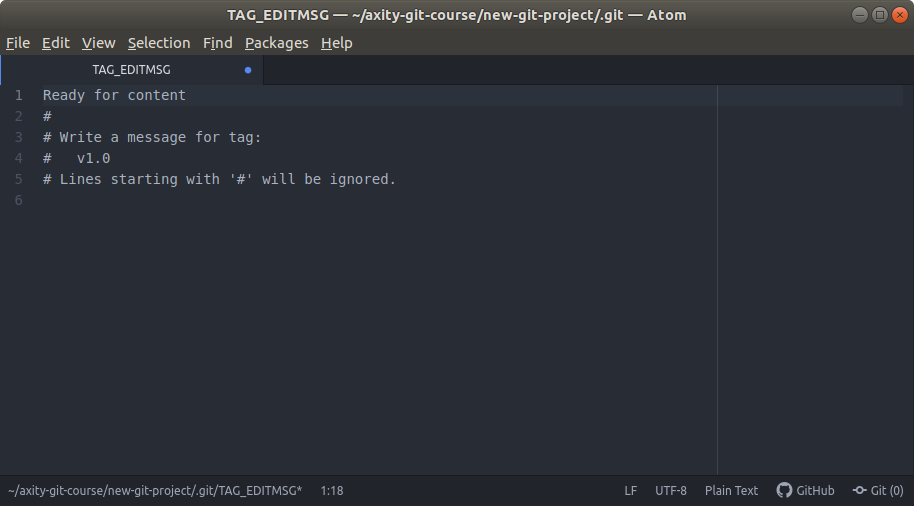
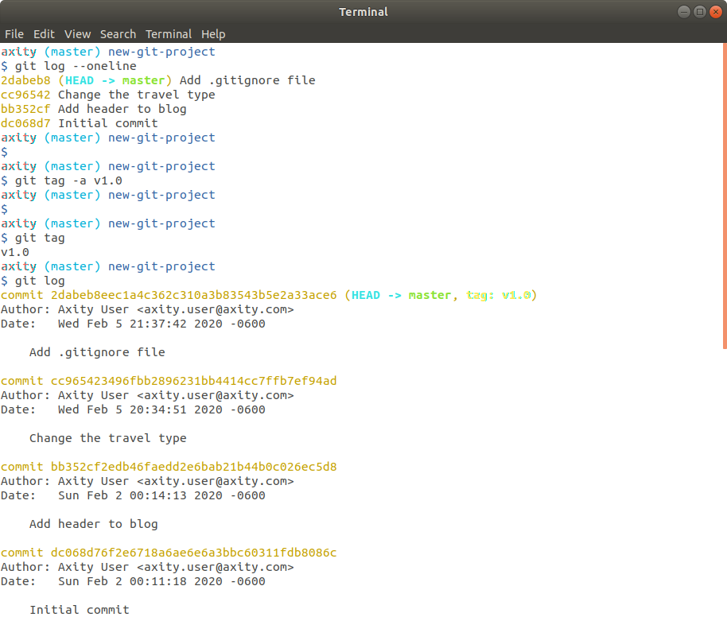
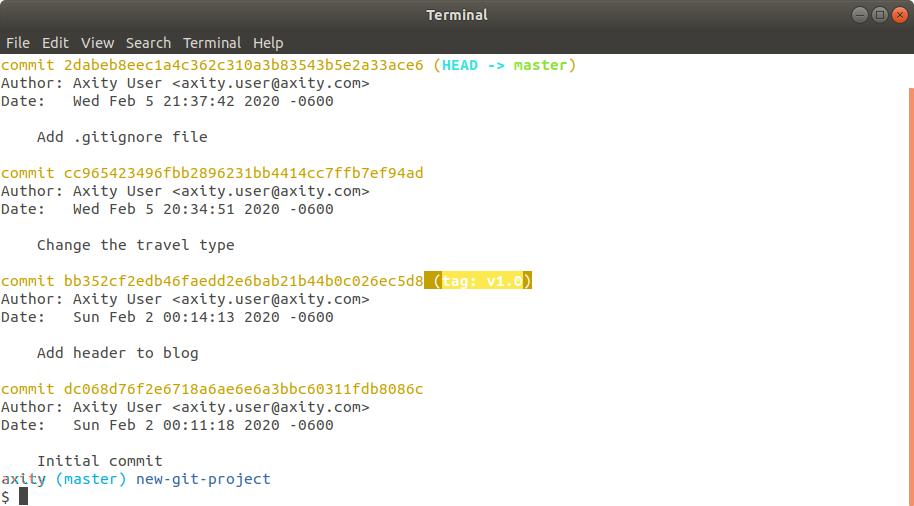

## Tagging, Branching & Merging

En esta lección veremos como:

 - Vistazo general
 - Crear Tag's
 - Crear Branches
 - Cambiar entre Branches
 - Realizar un Merge entre Branches
 - Tratar posibles problemas al hacer Merge

## Vistazo general
En esta lección veremos los siguientes comandos:
 - `git tag` para agregar etiquetas a commits específicos; un tag es una etiqueta que nos permite identificar un punto del desarrollo, por ejemplo, una versión beta. 
 - `git branch` para generar ramas las cuales pueden estar asociadas a diferentes características de un proyecto que se desarrollan en paralelo.
 - `git checkout` el cual nos permite movernos entre los diferentes  branches y tag's
 - `git merge` para combinar los cambios realizados en diferentes branches de forma automática

**Video >>> (dar clic)**

[](http://www.youtube.com/watch?v=D4VdXT72ASE "Git Tag")

## Cear un Tag

### Crear un tag en el punto actual

Continuando con nuestro repositorio `new-git-project` crearemos un **tag** con el siguiente comando:

```bash
$ git tag -a v1.0
```
Esto abrirá el editor por defecto para poder generar un mensaje para el **tag**, en este caso ingresaremos el mensaje `Ready for content`.

Después de esto guardamos y cerramos el editor.



> Se recomienda el uso de la opción `-a` ya que esta incluirá información adicional como:
> 
> - la persona que generó el tag
> - la fecha en que fue realizado
> - el mensaje del tag
>
> si no se incluye la opción `-a` entonces se creará un **tag ligero**

Para verificar que el **tag** se ha creado e identificar el punto (SHA) donde se ha creado el tag ejecutamos:
```bash
$ git tag -a v1.0
$ git log
```



### Borrar un tag

Para borrar un tag ejecutamos:
```bash
$ git tag -d v1.0
```
> Otra opción es: `git tag --delete v1.0`

### Agregar un tag a un commit pasado

Si queremos agregar un **tag** sobre un **commit** específico (por ejemplo, apuntando al SHA asociado al commit **Add header to blog**) ejecutamos el siguiente comando:
```bash
$ git tag -a v1.0 bb352c
$ git log
```




<!--stackedit_data:
eyJoaXN0b3J5IjpbNTIwMjA2NjYwLC0xNDE5NDU3Nzg4LDE4ND
c0Njk4NjEsLTQzMDcyNTAxLDI4NjY4NDE5NCwtMTY2MDgzMDky
NSwtMTkzMDUwMjQ4LC0xODExMjE4NTk5LDE4MjU1MDMxNzVdfQ
==
-->