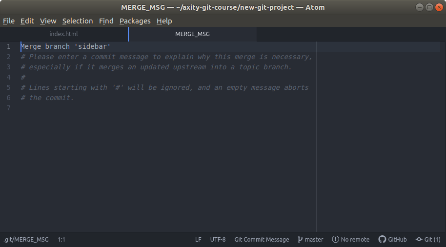
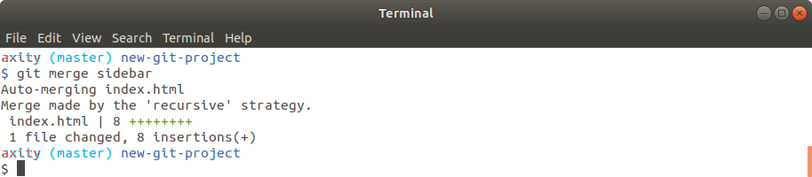

# Merging

En esta lección veremos los dos principales tipos de **Merge**:

 - ¿Qué es merge?
 - Fast-forward merge
 - Regular merge

## ¿Qué es merge?
Recordemos que el propósito de un branch (por ejemplo `sidebar`) es que nos permite realizar cambios que no afectan al branch `master`. Una vez que realizamos cambios en el branch `sidebar` podemos decidir que esos cambios no aplicarán, eliminarlos o mantenerlos y posteriormente combinarlos con otra rama.

**A la acción de combinar dos branches se le denomina `merge`.**
ara entender como funciona el comando merge, podemos ver el siguiente video:

**Video >>> (dar clic)**

[](http://www.youtube.com/watch?v=gQiWicrreJg "Git merge")

## Fast-forward merge
Este es el mas simple de los merge, ya que como se puede observar en el video, el apuntador `HEAD` del branch `master` es movido al commit más `adelantado`.

> Recordemos en en la práctica anterior creamos un branch llamado `footer` basado en el branch `master`. Sobre `footer` (el cual en ese momento es una copia de `master`) se agregaron los enlaces de redes sociales. Por lo que footer tiene el commit más `adelantado`.

Tomando como base el resultado de la práctica anterior, para realizar un fast-forward merge ejecutamos el siguiente comando:

```bash
$ git merge footer
```


## Regular merge
Este tipo de merge es el más común ya que implica combinar dos branches cuyas rutas son diferentes. 

> Recordemos en en la práctica anterior creamos un branch llamado `sidebar` basado en el branch `master`. Tanto en master como en sidebar realizamos cambios por lo que ambos branches tomaron rutas diferentes

Para realizar un regular merge ejecutamos el siguiente comando:

```bash
$ git merge sidebar
```



> Esta acción implica realizar un `commit`, ya que la propia acción de este tipo de merge implica cambios sobre los archivos.
> Podemos cambiar el mensaje del commit, sin embargo es una práctica común usar el mensaje de commit del merge por defecto.




## Further Research

-   [Basic Merging](https://git-scm.com/book/en/v2/Git-Branching-Basic-Branching-and-Merging#Basic-Merging) from Git Book
-   [git-merge](https://git-scm.com/docs/git-merge) from Git Docs
-   [git merge](https://www.atlassian.com/git/tutorials/git-merge) from Atlassian blog
<!--stackedit_data:
eyJoaXN0b3J5IjpbMTYzOTE2MTQ1MywtMTMxMjYxNTI1NiwtMT
czNzI0NTMwNiwyMTI5MDU4NjQxLC0zODQ2NDIyMzEsNDc0MTQ3
OTUyXX0=
-->