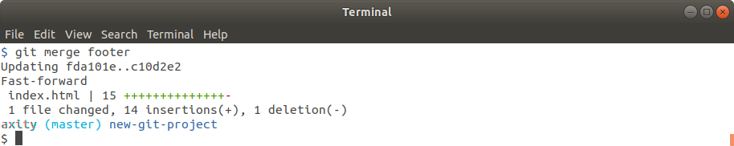
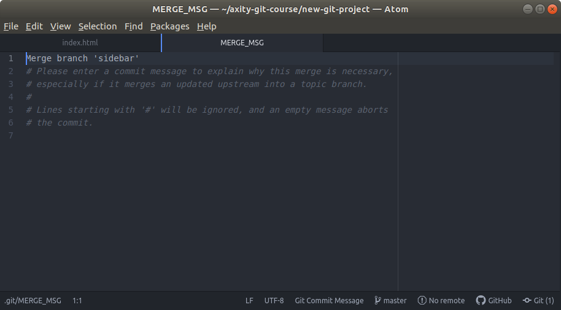

# Manejando conflictos durante un merge

 - Un conflicto durante un merge puede ocurrir cuando una misma línea en un archivo es modificada en dos o más branches por separado. Por ejemplo, si dos personas realizan un cambio sobre el texto del título de la página web en diferentes branches.
 - En estos casos Git no puede determinar de forma automática cual línea conservar y cual eliminar.

## Forzar a un conflicto en merge

### Práctica 09 - Simular un conflicto en merge

Para simular un conflicto durante un merge y aprender como manejar este tipo de conflicto realizaremos los siguientes pasos:

> Recuerda realizar commit despues de cada paso.

 1. En el archivo `index.html`, cambiar el encabezado `"Adventure"` por `"Quest"`en el branch `master`. Mensaje: `"Set page heading to Quest"`.

 2. Crear el branch `heading-update` apuntado al penúltimo commit (el penúltimo commit debe estar asociado al mensaje `"Merge branch 'sidebar'"`). Este cambio debe ser hecho sobre el branch `heading-update`. 

 3. En el archivo `index.html`, cambiar el encabezado `"Adventure"` por `"Crusade"`en el branch `heading-update`. Mensaje: `"Set page heading to Crusade"`.

 4. Establecer `master` como el branch activo.
 5. Ejecutar el comando de `merge`:

```bash
$ git merge heading-update
```

El resultado debería verse como sigue:



Este mensaje indica que GIt no pudo realizar un merge automático y que debemos resolver estos conflictos de forma manual.

 6. Abrir el archivo `index.html` en Atom.



Aqui podemo observar los sigientes indicadores de conflicto durante el merge:

-   `<<<<<<< HEAD` todo lo que está después de este indicado (hasta antes del siguiente) corresponde al branch actual
-   `||||||| merged common ancestors` odo lo que está después de este indicado (hasta antes del siguiente) 
- everything below this line (until the next indicator) shows you what the original lines were
-   `=======` is the end of the original lines, everything that follows (until the next indicator) is what's on the branch that's being merged in
-   `>>>>>>> heading-update` is the ending indicator of what's on the branch that's being merged in (in this case, the `heading-update` branch)


 7. Ejecutar el comando de `status` para conocer las acciones pendientes.

```bash
$ git status
```


<!--stackedit_data:
eyJoaXN0b3J5IjpbLTQ3OTAzMTcxOSw3MjYwNTY4MjcsLTY4MT
Y0NDk3MiwxNzc4NzQyOTkxLC0zODAwNTM0MzVdfQ==
-->