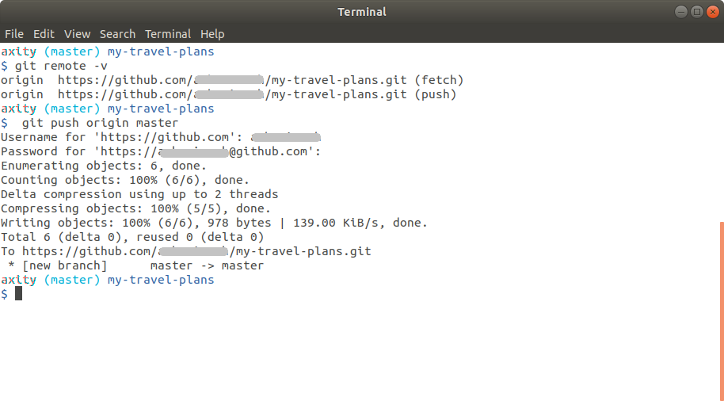

# Trabajando con repositorios remotos

En esta lección conoceremos como trabajar con repositorios remotos de GitHub y como obtener y enviar cambios a un repositorio remoto.

## ¿Qué es GitHub?

Git es un sistema de control de versiones distribuido, lo que significa que no hay un depósito principal de información. Cada desarrollador tiene una copia del repositorio. Por lo tanto, puede tener una copia del repositorio (que incluye los commits publicados y el historial de versiones) y otros usuarios también pueden tener una copia del mismo repositorio. Cada repositorio tiene exactamente la misma información que los otros, no hay un repositorio que sea el principal.


La forma en que podemos interactuar y controlar un repositorio remoto es a través del comando remoto de Git:

```bash
$ git remote
```

[](http://www.youtube.com/watch?v=414f0ukhOTY "Git remote")

## Práctica 11 - Git Remote

Para crear un repositorio remoto debemos ejecutar los siguientes comandos:

 1. Crear el directorio `~/axity-git-course/my-travel-plans`

 2. Inicializar el directorio usando el comando `git init`

 3. Crear el archivo `README.md`

 4. Crear el archivo `index.html`

 5. Crear el archivo `app.css`

#### Contenido de `README.md`

```markdown
# Travel Destinations

A simple app to keep track of destinations I'd like to visit.
```

### Contenido de `index.html`

```html
<!doctype html>
<html lang="en">
<head>
    <meta charset="utf-8">
    <title>Travels</title>
    <meta name="description" content="">
    <link rel="stylesheet" href="css/app.css">
</head>
<body>

    <div class="container">
        <div class="destination-container">
            <div class="destination" id="florida">
                <h2>Florida</h2>
            </div>

            <div class="destination" id="paris">
                <h2>Paris</h2>
            </div>
        </div>
    </div>

</body>
</html>
```

### Contenido del archivo app.css

```css
html {
    box-sizing: border-box;
    height: 100%;
}

*,
*::before,
*::after {
    box-sizing: inherit;
}

body {
    display: flex;
    margin: 0;
    height: 100%;
}

.container {
    margin: auto;
    padding: 1em;
    width: 80%;
}

.destination-container {
    display: flex;
    flex-flow: wrap;
    justify-content: center;
}

.destination {
    background: #03a9f4;
    box-shadow: 0 1px 9px 0 rgba(0, 0, 0, 0.4);
    color: white;
    margin: 0.5em;
    min-height: 200px;
    flex: 0 1 200px;
    display: flex;
    justify-content: center;
    align-items: center;
    text-align: center;
}

h2 {
    margin: 0;
    transform: rotate(-45deg);
    text-shadow: 0 0 5px #01579b;
}

#florida {
    background-color: #03a9f4;
}

#paris {
    background-color: #d32f2f;
}
```
 6. Guardar y cerrar los archivos.

 7. Realizar `commit`  con el mensaje `"Initial commit"`.

 8. El archivo `index.html` debería verse así:


### Crear un repositorio en GitHub

 1. Crear una cuenta en GitHub

 2. Crear un repositorio con el nombre `my-travel-plans`

 3. Asegurar que al momento de crear el repositorio **NO** marcar la opción de `"Initialize this repository with a README"`.

###  Crear una conexión del repositorio local al remoto

 1. Ejecutar el siguiente comando 

```bash
$ git remote add origin https://github.com/<my usuario>/my-travel-plans.git
```

 2. Para verificar que la conexión se ha creado correctamente debemos ejecutar el siguiente comando:

```bash
$ git remote -v
```
### Enviando commits al repositorio remoto (push)

Para entender  como funciona el comando push veamos el siguiente video:

**Video >>> (dar clic)**

[](http://www.youtube.com/watch?v=21TvMEtMRys "Git push")

 1. Para enviar los commits de nuestro repositorio local al repositorio remoto debemos ejecutar:

```bash
$ git push origin master
```



 2. En la cuenta de GitHub validar que los archivos y commits han sido sincronizados.


### Recuperar cambios desde un repositorio remoto

 1. En la cuenta de GitHub, en el repositorio `my-travel-plans`, editar el archivo `app.cs` y agregar el siguiente código:

```css
.destination:hover h2 {
    transform: rotate(0deg);
}
```

 2. Agregar la siguiente línea dentro de las reglas de `h2`

`transition: transform 0.5s;`

 3. 
 4.  Hacer commit con el mensaje `"Add animation to destination headings"`.
 5. 

<!--stackedit_data:
eyJoaXN0b3J5IjpbNzg3NTY4MTY5LC0xMDQzMjIwMDgwLC0xMD
E0OTgyMTM3LC0yMzgyMjk5NzUsLTE1MDQwODE4NzUsMTM5ODAw
NTYwNSwzNjExOTkwNTQsODUxODkwMDgwLC0xOTkwODQyNzQ0LC
0xODUyNTI4NTA4LDQ2OTc0ODAwMiwxMjEyMTQ4OTI3LDE2NTQ4
Mzc0NzEsMTMxNDczNDU1NywtMTU0NDAzNTcwNywxNzEyNDIzOT
QxLDEzNjQ4NzkxODcsNzA2ODAwOTcxLDEzNzY4NDgwOTQsLTUy
Mjc3OTkwNl19
-->