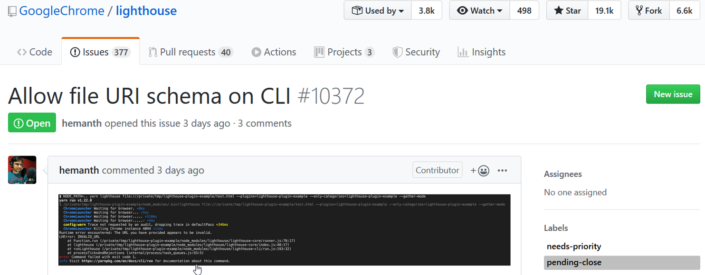

# Trabajando con otros desarrollos

 - En esta lección veremos:

 - La funcionalidad de `Fork`

 - Como obtener el historial de cambios

 - Como identificar en lo que podemos trabajar

## Entendiendo la funcionalidad de `Fork`

 - `Fork` es una acción hecha sobre el servicio de **GitHub**:

 - Realiza una copia idéntica de otro repositorio.
 
 - Se tiene control total sobre la copia del repositorio.
 
 - Los cambios realizados en la copia no afectan al repositorio original.
 
 - `Fork` no es un comando de **Git**
 
 - `Fork` es una funcionalidad de **GitHub**

Para entender cómo funciona la funcionalidad de `fork` en **GitHub** realice los siguientes pasos:

1. Use `git clone` para clonar [Proyecto my-travel-plans de Lam](https://github.com/udacity/course-collaboration-travel-plans).

2. Hacer al menos un cambio en el repositorio (local).

3. Hacer `commit`.

4. Usar git push para enviar los cambios al repositorio de **Lam**

**¿Qué es lo que observa?**

> Podemos observar que al ejecutar git push nos devuelve el error "unable to access".

Ahora hagamos lo siguiente:

 1. Ingresemos en el [Proyecto my-travel-plans de Lam](https://github.com/udacity/course-collaboration-travel-plans).

 2. Damos clic en el botón **Fork**.

 3. Verificamos que ahora el repositorio de Lam se encuentra listado en nuestros repositorios.

 4. Volvemos a ejecutar `git push` para enviar los cambios al repositorio de **Lam**

**¿Qué es lo que observa ahora?**

> Podemos ver ahora los cambios son enviados al repositorio de Lam".

## Revisar el historial de cambios

 1. Clonar el [Proyecto Lighhouse](https://github.com/GoogleChrome/lighthouse).

 2. Moverse al directorio del repositorio recién clonado.

### Agrupado por autor

```bash
$ git shortlog
```

### Por el número de commits ordenado numéricamente 

```bash
$ git shortlog -s -n
```

## Filtrar por autor

```bash
$ git log --author=Surma
$ git log --author="Paul Lewis"
```

## Filtrar por commit específico

```bash
$ git show 5966b66
```

## Filtrar por una palabra en el mensaje del commit

```bash
$ git log --grep=bug
$ git log --grep bug
```

## Identificar en lo que podemos trabajar

En proyectos donde los equipos de desarrollo son más grandes es común que todos aquellos participan estén colaborando de forma activa. Para hacer esto de forma coordinada y ordenada es común que existan un archivo llamado `CONTRIBUTING.md`.

Este archivo típicamente consta de dos secciones:

- For Contributors

- For Maintainers

`CONTRIBUTING.md` contiene información que explica:

 - Como debe estar formateado el código

 - Pasos a seguir para contribuir

Antes de empezar a colaborar en un proyecto es importante saber si alguien más ya está trabajando en eso mismo.

Para estos casos la sección de Issues nos permite realizar una petición para poder contribuir sobre:

 - Un bug
 - Una nueva funcionalidad
 - Algún oro tema

Navegue en el [Proyecto Lighhouse](https://github.com/GoogleChrome/lighthouse) para ubicar el archivo `CONTRIBUTING.md`.

Dentro de la sección de Issues para familiarizarse. Note que el botón de "**New Issue**" siempre está presente en esta sección.

Intente crear un nuevo **Issue** para ver las opciones que nos permite.



<!--stackedit_data:
eyJoaXN0b3J5IjpbMTgxMzQ0MjAwNCw3NDk2NDc4MzAsMTI3Nj
k0NjczLDMxMjMyNzE2NywtNTk5MzY4MzM5LC0yMDU4NzU0MjRd
fQ==
-->