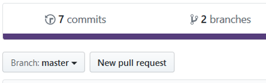
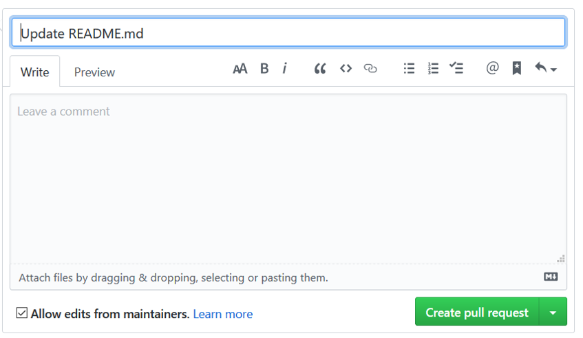

# Permanecer sincronizado con un repositorio remoto

Un **pull request** es una petición o solicitud al administrador (Maintainer) del repositorio original para incluir cambios en su proyecto sobre el cual hemos echo un `Fork`.

 - Hacer Fork sobre el proyecto de [Axity](https://github.com/achamizoch/axity-collaboration-travel-plans)

 - Crear un `branch` con el nombre `include-<usuario>-destinations`.

 - Hacer al menos un `commit` en el branch que ha creado.

 - Hacer `push` sobre su proyecto asociado al Fork.

 - Ingrese a su cuenta de GitHub en el repositorio sobre el que realizó el Fork (no el original, el que se creó en su cuenta).

 - Dar clic sobre el botón "**New pull request**".

 - Del lado izquierdo seleccione el repositorio original y el branch sobre el cual se solicita aplicar los cambios.

 - Del lado derecho seleccione su repositorio (Fork) y el branch que creó previamente y sobre el que hizo los commits.

 - Dar clic sobre el botón "`Create pull request`".

 - Ingresar un título y una descripción del mensaje.

 - Dar clic sobre el botón "`Create pull request`".

## Obtener los ca
<!--stackedit_data:
eyJoaXN0b3J5IjpbLTE5MTY1Njc3MjgsLTE2NTQxNTI5OTMsMT
g2NjQ2NTM0NCwtMTUxMTkwMDQwOCwxOTAzMzY1NzMxLDE5NTEw
MTkwODBdfQ==
-->