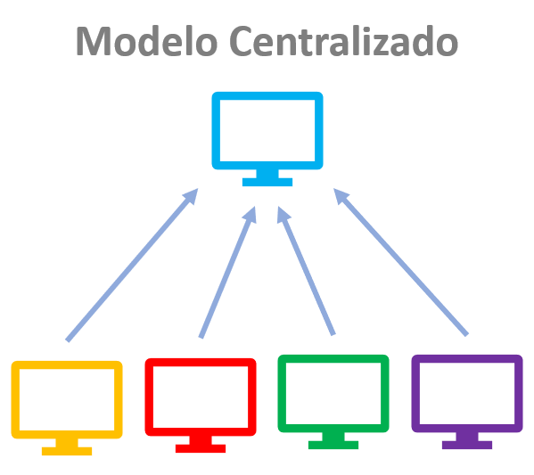
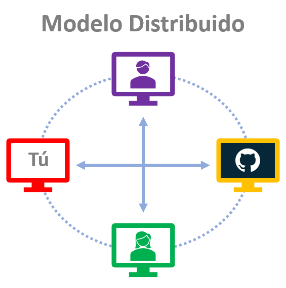

# Control de versiones con Git

 - ¿Qué es Control de Versiones?
 - Crear un repositorio de Git
 - Revisar el historial de un repositorio Agregar Commit’s a un repositorio
 - Tagging, Branching ang Merging
 - Deshacer cambios Trabajar con repositorios remotos (GitHub)
 - Trabajando sobre un repositorio de otro desarrollador Crear y administrar Pull Requests

# ¿Qué es Control de Versiones?

> Version Control System (**VCS**) es un software cuyo propósito es ayudar a controlar y administrar diferentes versiones de algo, típicamente código fuente.

Objetivos principales de Git:

 - Mantener un historial detallado del proyecto, así como la capacidad de trabajar en diferentes versiones del mismo. 
 - Mantener un historial detallado de un proyecto para dar seguimienti a su progreso y avance a lo largo del tiempo. 
 - Volver a cualquier punto del proyecto para recuperar datos o archivos.

## Diferencias entre Git y GitHub

 - [Git](https://git-scm.com) es la herramienta de control de versiones
 - [GitHub](https://github.com) es el servicio en la nube que administra los proyectos de Git

## Otros Sistemas de Control de Versiones

 - [Git](https://git-scm.com)
 - [Subversion](https://subversion.apache.org)
 - [Mercurial](https://www.mercurial-scm.org)

## Modelos de Sistemas de Control de Versiones

##

##
Existen principalmente dos tipos de modelos de VCS:

 - Modelo Centralizado: todos los usuarios se conectan a un repositorio maestro central
 - Modelo Distribuido: cada usuario tiene el repositorio completo en su computadora

> Git  es un sistema de control de versiones distribuido.

# Conceptos básicos

###  Sistema de control de versiones / Administrador de código fuente

Sistema de Control de Versiones (VCS) es una herramienta que administra diferentes versiones del código fuente. Administrador de Código Fuente (abreviado como SCM) es otro nombre para un Sistema de Control de Versiones.

###  Commit

Git esta diseñado para administrar datos/archivos como un conjunto de fotos de un mini sistema de archivos. En Git, cada vez que se realiza una acción de *Commit*, básicamente se toma una fotografía del estado en que se encuentran todos los archivos en ese momento y almacena una referencia a esa foto.

> Un **Commit** es la unidad básica y fundamental en Git.

### Repository / Repositorio

Un *repositorio - es un directorio que contiene un proyecto, así como algunos archivos internos para la gestión y administración del propio proyecto de Git.

Los repositorios pueden existir localmente en tu computadora o como una copia remota en otra computadora. 

> Un repositorio está formado por **Commits**.*

### Working Directory / Directorio de Trabajo

El directorio de trabajo son los archivos que ves en el sistema de archivos de tu computadora. Cuando abres los archivos de tu proyecto en un editor de código, estás trabajando con archivos en el Directorio de Trabajo.

Esto es diferente a los archivos que se han guardado (con commits) en el repositorio.

**Ojo**: *El repositorio de trabajo no es lo mismo directorio actual (pwd/cd) donde te encuentras cuando usas una terminal.*

### Checkout

Un Checkout es cuando el contenido del Repositorio se ha copiado al Directorio de Trabajo.

### Staging Area / Staging Index / Index

Es un archivo en el directorio de Git que almacena información sobre lo que se incluirá en en el siguiente **Commit**, es decir, los archivos en el Staging Area están listos para ser agregados al repositorio.

### SHA

Un **SHA** (Secure Hash Algorithm) es básicamente un **ID** para cada **Commit**. Así es como se vería el SHA de un Commit:

    59eab362889d69dc9a52a44dff4f3656ebc1fd41

**SHA** es una cadena de 40 caracteres compuesta de caracteres (0–9 y a – f) y calculada en función del contenido de un archivo o estructura de directorios en Git.

### Branch / Rama

Una rama es cuando se crea una nueva línea de desarrollo que diverge de la línea principal de desarrollo. Esta línea alterna de desarrollo puede continuar sin alterar la línea principal.
##

Con esta terminología en mente, echemos un vistazo de alto nivel a cómo usaremos Git al observar el flujo de trabajo típico al trabajar con el control de versiones.

<!--stackedit_data:
eyJoaXN0b3J5IjpbMTE0NDI1NjIyNCwtMTQ4NjkzNDg2MiwtMT
I4MzkyODg1MywtMTY0MDM3NDkzLC05MzgwOTkyNTUsMTg5NDAy
OTM1LC02OTE3ODUzMTEsNjI0NzM2MDMsMjEwMTE4OTUyOSwyNj
AwMjAyM119
-->